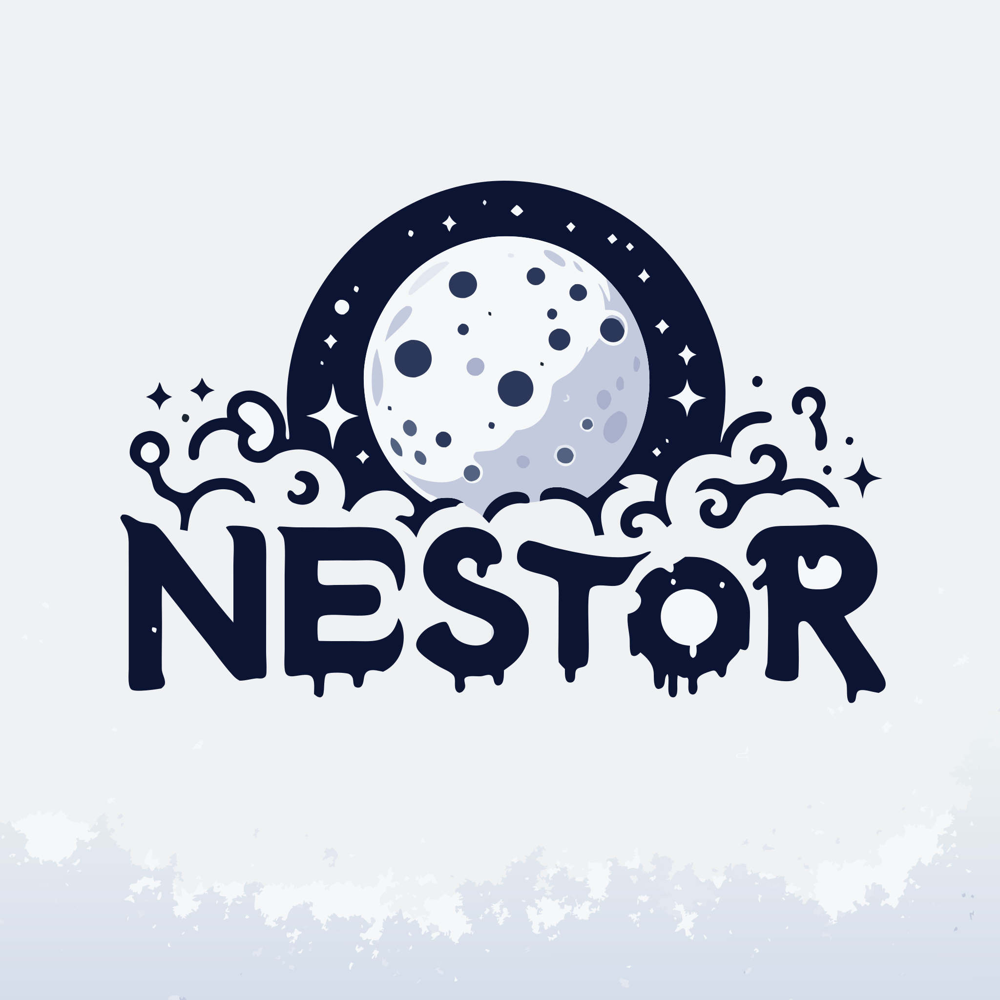

  

<h1 align="center">Welcome to Nestor VRC 🌟</h1>

  
  

## 🌟 About Us

At **Nestor VRC**, we are a group of passionate individuals dedicated to
creating creative and meaningful solutions. We believe that the purpose behind
what we do will drive us forward and help us make an impact on the world of
VRChat.

Our projects range from web applications to open-source tools, leveraging the
latest technologies to make a difference. Join us on this journey to innovate
and collaborate!

## 🏆 Our Projects

Here’s a look at some of the projects we’ve been working on:

- **[VRChat Launcher](https://github.com/nestor-vrc/VRChat-Launcher)**:
  Streamlined launching & improved performance with privacy in mind! 🚀🔒
- **[NestorSDK](https://github.com/nestor-vrc/NestorSDK)**: AEmpowering
  developers with enhanced tools for immersive experiences, bypassing VRCSDK
  limitations! 🌟🛠️
- **[VRChime](https://github.com/nestor-vrc/VRChime)**: Easily test VRChat
  worlds from .vrcw files! 🕹️✨

Explore our
[GitHub repositories](https://github.com/orgs/nestor-vrc/repositories?q=mirror%3Afalse+fork%3Afalse+archived%3Afalse+visibility%3Apublic)
to see the full list of projects.

## 📫 Get in Touch

Feel free to reach out to us on:

- **[Discord](https://discord.gg/PaVYAuymgm)**
- **[Website](https://nestor.vercel.app/)**

Let's collaborate and build something amazing together! ✨

